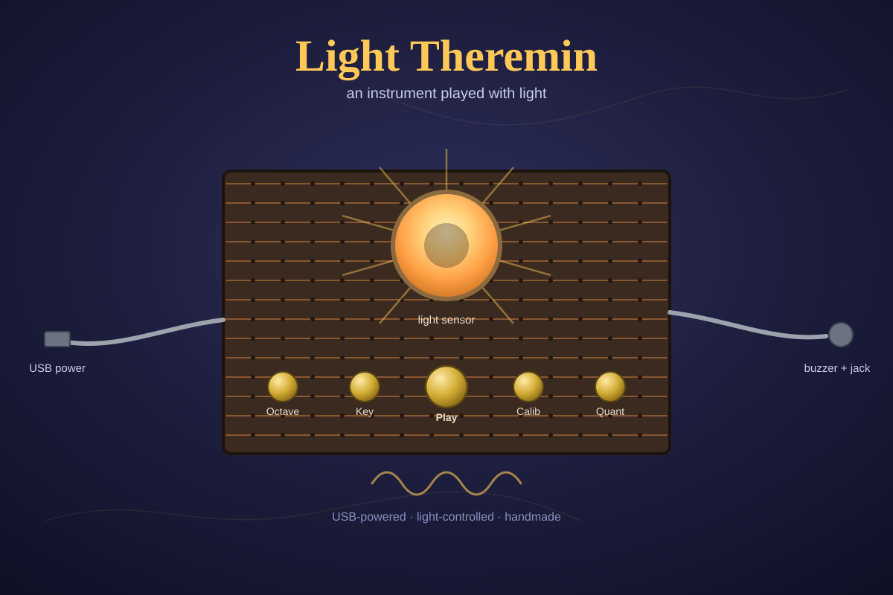

# Light Theremin — Project Overview

## What is this?

A theremin is a classic electronic instrument played without touching it — you move your hands near two antennas and the instrument's pitch and volume change with your hand's distance. It's one of the earliest electronic instruments ever built.

This project is our own spin on that idea: instead of antennas, we're using a **light sensor (LDR)**. Wave a hand over it, shine a flashlight on it, or play it outdoors versus in a dim room, and the pitch changes. It's USB-powered, hand-soldered on stripboard, and built entirely from parts you can source cheaply and solder yourselves.

## Why light, and why not just a plain theremin?

A true antenna-based theremin needs precise analog tuning circuitry that's genuinely hard to get right, especially at a class-sized scale. A light sensor gives us the same "control something by moving your hand in the air" magic, but through a circuit any of us can wire, read, and debug: the LDR's resistance changes with light, we read that as a voltage on one analog pin, and turn that number into a pitch.

## What makes it more than a toy synth

Play a plain continuous-pitch instrument with your hand in the air and it's genuinely hard to hit a note on purpose — that's true of real theremins too, and it's part of why they take real practice to play well. We borrowed a different idea from **handpans and hang drums**: those instruments give you a fixed set of "notches" — specific notes dimpled into the metal — so that no matter where you strike, you land on a note that belongs to the scale.

Our instrument does the same thing in software. A **quantization** mode snaps whatever pitch the light level maps to onto the nearest note in a chosen scale, so it's much easier to play something musical. Turn quantization off, and you get the full continuous glide of a real theremin instead.

## What it does

- **Play button** — produces sound (shaped with a real attack/decay/sustain/release envelope, not just an on/off beep)
- **Octave button** — shifts the whole range up or down an octave
- **Key/mode button** — cycles through a set of pre-defined scales
- **Calibration button** — teaches the device your room's brightest and darkest light levels, so it works whether you're playing in a sunny classroom or a dark corner with a flashlight
- **Quantization toggle** — switch between snapped-to-scale notes and free continuous pitch
- **USB powered** — no battery to replace or leak
- **Dual output** — a piezo buzzer built in, plus a 3.5mm jack so it can plug into a speaker or headphones

## What you'll learn building one

- Reading an analog sensor and mapping its range to something useful (and why that mapping shouldn't be linear — pitch perception isn't)
- Basic digital input handling (buttons, debouncing)
- Soldering a real circuit from a schematic onto stripboard
- How simple audio synthesis works on a microcontroller (oscillators, envelopes, sample rates)
- Why design constraints (cheap parts, no case, USB power, a batch of many units) shape engineering decisions

## Where to go next

- [`BUILD_GUIDE.md`](BUILD_GUIDE.md) — step-by-step assembly instructions
- [`wiring-diagram.svg`](wiring-diagram.svg) — the reference diagram used throughout the build guide
- [`README.md`](README.md) — technical reference: full hardware list, pinout, and software notes
